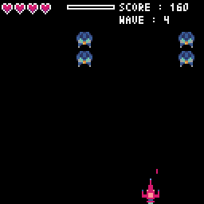
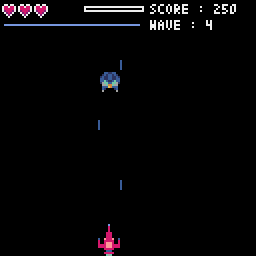
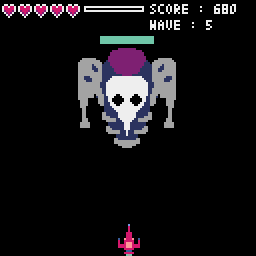
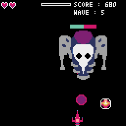
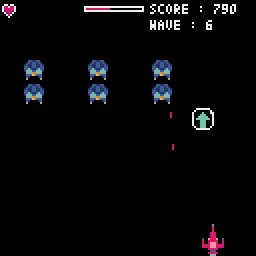
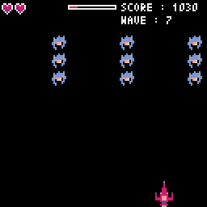
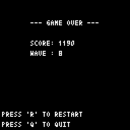

# Pixel Invaders

[🇬🇧 English](README.md) | [🇫🇷 Français](docs/README.fr.md)

*"Pixel Invaders"* is a retro arcade game where you pilot a spaceship to destroy waves of alien invaders. Designed in Python with the Pyxel library, it blends classic pixel art and action for a dynamic yet nostalgic experience.

This project serves as an introductory exercise to explore the power of GitHub, focusing on key features such as pull requests and GitHub Actions.

## Preview

|  |  |  |  |
|-----------------------------------------|-----------------------------------------|-----------------------------------------|-----------------------------------------|
|  |  |  |  |


## Table of Contents

- [Prerequisites](#prerequisites)
- [Features](#features)
- [Controls](#controls)
- [Installation](#installation)
- [License](#license)
- [Contact](#contact)

## Prerequisites

This project requires [Python 3.6+](https://www.python.org/) and [Git](https://git-scm.com/) installed on your machine. If you need to install them, click on the respective links.

## Features

#### Gameplay  

- Pilot a spaceship to defend the galaxy against relentless enemy waves.  
- Fire classic lasers or smart missiles that home in on the nearest enemy.  
- Overheat mechanism prevents spamming, promoting strategic shooting.  
- Enemies grow stronger with each wave.  
- Boss fights at waves 5, 10, 15…, featuring special explosive attacks.  
- Rack up points and survive for as long as possible.
- Lose all your lives, and it's game over.

- Power-ups:
  - Speed Boost – Dash through space with increased velocity.
  - Rapid Fire – Unleash a temporary barrage of shots.
  - Extra Life – Grants an additional life.  
  - Big Shot – Fire stronger, faster projectiles.
  - Slow Down Enemies – Temporarily reduces enemy movement speed.

#### Architecture

- Object-Oriented Programming (OOP) – Dedicated classes for each game component.  
- Dynamic Wave Management – Configurable via JSON for easy customization.  
- Optimized Asset Management – Efficient handling of spritesheets.  
- Automated Code Styling – Black for clean Python formatting, enforced via GitHub Actions.

## Controls

| Action        | Key               |
|---------------|-------------------|
| Move Left     | Left Arrow or A/Q |
| Move Right    | Right Arrow or D  |
| Fire          | Spacebar          |
| Restart Game  | R                 |
| Quit Game     | Esc (Échap)       |

## Installation

To run the game locally, follow these steps :

1. Clone the repository:
   ```bash
   git clone https://github.com/LeoLeman555/Pixel_Invaders.git
   ```
2. Navigate to the project directory:
   ```bash
   cd Pixel_Invaders
   ```
3. Create a virtual environment (recommended):
   ```bash
   python -m venv venv
   ```
4. Activate the virtual environment:
   - **On Windows**:
   ```bash
   venv\Scripts\activate
   ```
   - **On macOS/Linux**:
   ```bash
   source venv/bin/activate
   ```
5. Install the required dependencies:
   ```bash
   pip install -r requirements.txt
   ```
6. Start the game:
   ```bash
   python ./main.py
   ```

## License

This project is licensed under the MIT License. See the [LICENSE](LICENSE) file for more details.

## Contact

For any questions or feedback, feel free to contact me:

- **Léo Leman** : [My GitHub Profile](https://github.com/LeoLeman555)
