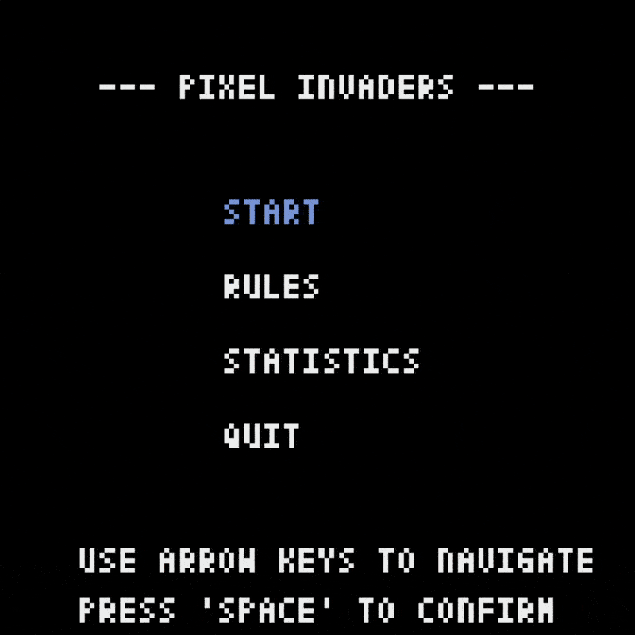
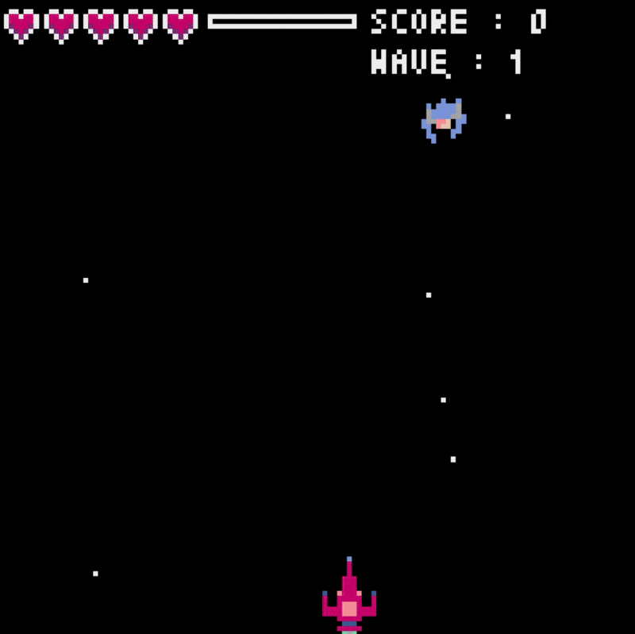
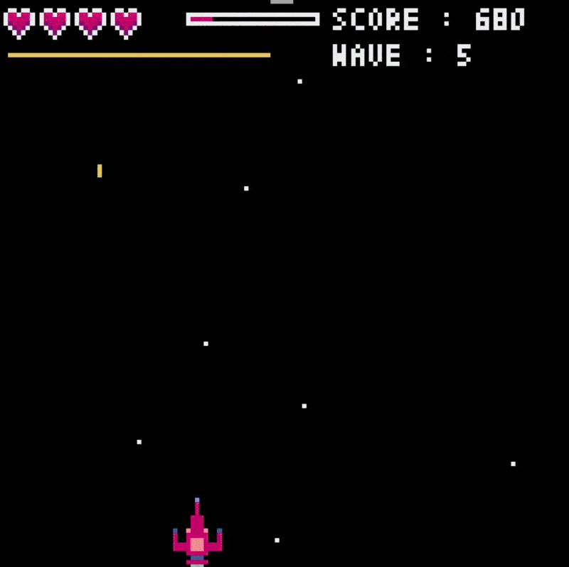
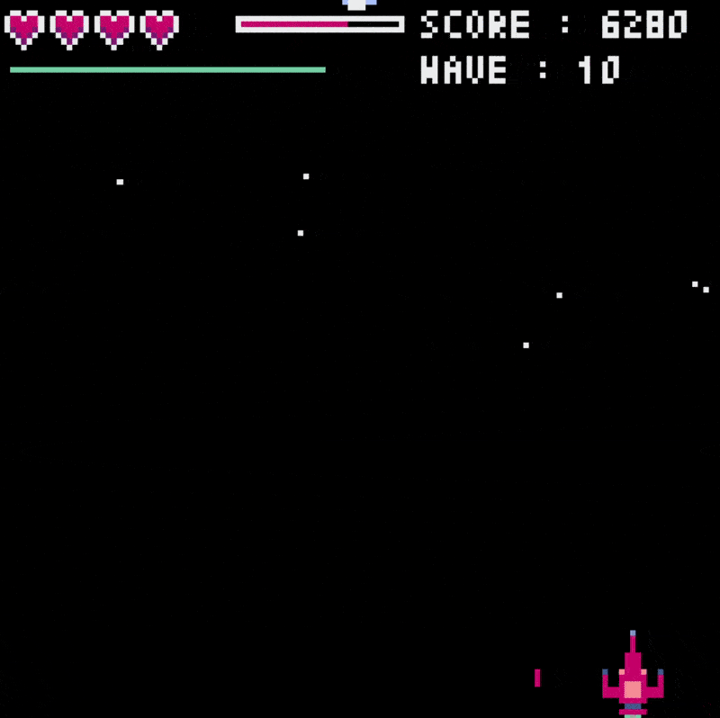

# Pixel Invaders

[](https://github.com/LeoLeman555/Pixel_Invaders/releases)
[](../LICENSE)


[](../README.md)
[](README.fr.md)

*"Pixel Invaders"* est un jeu d'arcade rétro où vous pilotez un vaisseau spatial pour détruire des vagues d’envahisseurs extraterrestres. Conçu en Python avec la bibliothèque Pyxel, il mêle pixel art classique et action pour une expérience à la fois dynamique et nostalgique.

Ce projet est un exercice d'introduction à l'utilisation des capacités de GitHub, y compris les Pull Requests, les Issues et les actions GitHub. De plus, il sert d'expérience d'apprentissage pour l'empaquetage et la publication sur PyPI.

## Aperçu

|  |  |
|-----------------------------------------|-----------------------------------------|
|  |  |


## Table des matières

- [Prérequis](#prérequis)
- [Fonctionnalités](#fonctionnalités)
- [Contrôles](#contrôles)
- [Installation](#installation)
- [Licence](#licence)
- [Crédits](#crédits)
- [Contact](#contact)

## Prérequis

Ce projet nécessite l'installation de [Python 3.11](https://www.python.org/) sur votre machine. Si vous ne l'avez pas encore installé, vous pouvez le télécharger sur le site officiel de Python.

## Fonctionnalités

#### Gameplay  

- Pilotez un vaisseau spatial pour défendre la galaxie contre des vagues d'ennemis implacables.  
- Tirez des lasers classiques ou des missiles intelligents qui se dirigent vers l'ennemi le plus proche.  
- Le mécanisme de surchauffe empêche le spamming et favorise le tir stratégique.  
- Les ennemis deviennent plus forts à chaque vague.  
- Affrontez de puissants boss aux vagues 5, 10, 15... chacun avec des attaques uniques comme des explosions ou des barrières défensives.
- Accumulez des points et survivez le plus longtemps possible. 
- Perdez toutes vos vies et c'est la fin du jeu.
- Suivez vos statistiques et améliorez-les

- Power-ups:
  - Accélération - Traverse l'espace avec une plus grosse vitesse
  - Tir rapide - Permet de faire un barrage temporaire de tirs.
  - Vie supplémentaire - Octroie une vie supplémentaire.  
  - Big Shot - Tire des projectiles plus puissants et plus rapides.
  - Ralentir les ennemis - Réduit temporairement la vitesse de déplacement des ennemis.

#### Architecture

- Programmation orientée objet (POO) - Classes dédiées à chaque composant du jeu.  
- Gestion dynamique des vagues - Configurable via JSON pour une personnalisation facile.  
- Gestion optimisée des images - Traitement efficace des spritesheets.  
- Style de code automatisé - Black pour un formatage Python propre, appliqué via les actions GitHub.

## Contrôles

| Action        | Touche               |
|---------------|----------------------|
| Gauche        | Flèche Gauche ou A/Q |
| Droite        | Flèche Droite ou D   |
| Tirer         | Barre d'espace       |

## Installation

Pour exécuter le jeu localement, vous avez deux options : l'installer via pip ou cloner le dépôt manuellement.

### Installer via pip

1. Lorsque le jeu est publié sur PyPI, vous pouvez l'installer directement avec :
   ```bash
   pip install pixel-invaders
   ```
2. Ensuite, lancez le jeu avec :
   ```bash
   pixel-invaders
   ```

> Le projet est actuellement en cours de développement et sera bientôt disponible sur PyPI. Si cela n'est pas encore fait, veuillez suivre les instructions ci-dessous pour installer le jeu.

### Cloner le dépôt

1. Cloner le dépôt :
   ```bash
   git clone https://github.com/LeoLeman555/Pixel_Invaders.git
   ```
2. Naviguer dans le répertoire du projet :
   ```bash
   cd Pixel_Invaders
   ```
3. Créer un environnement virtuel (recommandé) :
   ```bash
   python -m venv venv
   ```
4. Activer l'environnement virtuel :
   - **Sur Windows**:
   ```bash
   venv\Scripts\activate
   ```
   - **Sur macOS/Linux**:
   ```bash
   source venv/bin/activate
   ```
5. Installer les dépendances nécessaires :
   ```bash
   pip install -r requirements.txt
   ```
6. Commencer le jeu :
   ```bash
   python ./main.py
   ```

## Licence

Ce projet est placé sous la licence MIT. Voir la [LICENCE](../LICENSE) pour plus de détails.

## Crédits
   - Code et Game design : [Léo Leman](https://github.com/LeoLeman555)
   - Spritesheets et Art : Santi
   - Construit avec : [Pyxel](https://github.com/kitao/pyxel)

Remerciements à la communauté open-source pour les outils et l'inspiration !

## Contact

Pour toute question ou commentaire, n'hésitez pas à me contacter :

- **Léo Leman** : [Mon profil GitHub](https://github.com/LeoLeman555)
